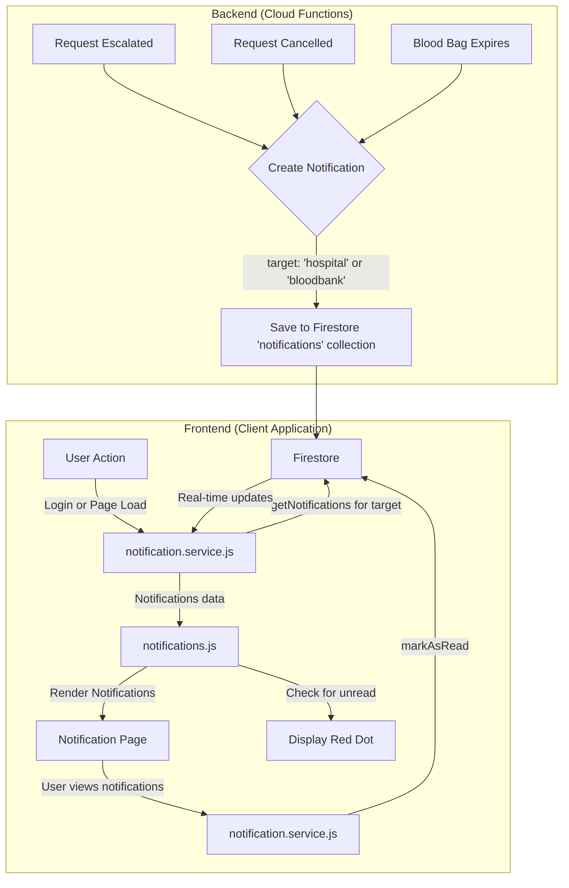

# Notification System Architecture

## 1. Notification Data Structure

The `Notification` object will be stored in a Firestore collection named `notifications`. Each document in the collection will represent a single notification and will have the following structure:

```json
{
  "notificationId": "string",
  "message": "string",
  "timestamp": "timestamp",
  "target": "string <'hospital' or 'bloodbank'>",
  "isRead": "boolean"
}
```

### Field Descriptions:

*   **notificationId**: A unique identifier for the notification. This will be the Firestore document ID.
*   **message**: The content of the notification.
*   **timestamp**: The date and time when the notification was created.
*   **target**: The intended audience for the notification.
*   **isRead**: A boolean flag to indicate whether the notification has been read.


## 2. High-Level Architecture

### Notification Creation and Storage

*   **Firestore Collection:** Notifications will be stored in a Firestore collection named `notifications`.
*   **Cloud Functions:** We will use Cloud Functions to automatically create notifications based on specific triggers. This decouples the notification logic from the main application logic.

#### Triggers for Cloud Functions:

*   **`onRequestStatusChange`**:
    *   **Condition**: When a request's status changes to `escalated`.
    *   **Action**: Create a notification for both `hospital` and `bloodbank`.
    *   **Condition**: When a request's status changes to `cancelled`.
    *   **Action**: Create a notification for the `bloodbank`.
*   **`onBloodBagExpiry`**:
    *   **Condition**: When a blood bag's `expiryDate` is reached.
    *   **Action**: Create a notification for the `bloodbank`.

### Frontend Notification Handling

*   **`notification.service.js`**: This service will be responsible for all interactions with the `notifications` collection in Firestore.
    *   `getNotifications(target)`: Fetches all notifications for a given target (`hospital` or `bloodbank`), ordered by timestamp.
    *   `markAsRead(notificationId)`: Updates the `isRead` status of a notification to `true`.
*   **`notifications.js`**: This view script will use the `notification.service.js` to fetch and display notifications.
    *   It will subscribe to real-time updates from Firestore to display new notifications instantly.
    *   A red dot will be displayed in the UI if there are any notifications with `isRead: false`.

### Unread Status Management

*   The `isRead` flag will be set to `false` by default when a notification is created.
*   When the user navigates to the notifications page, all displayed notifications will be marked as read by calling `markAsRead` for each notification.
*   The red dot indicator will be shown or hidden based on the presence of unread notifications.


## 3. System Architecture Diagram


