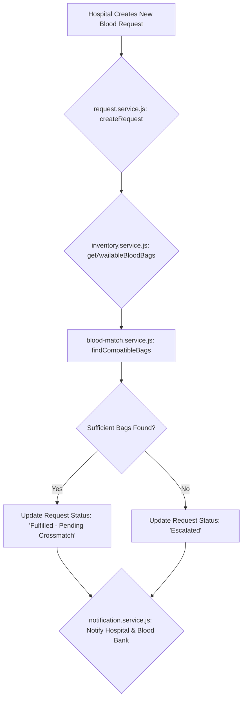
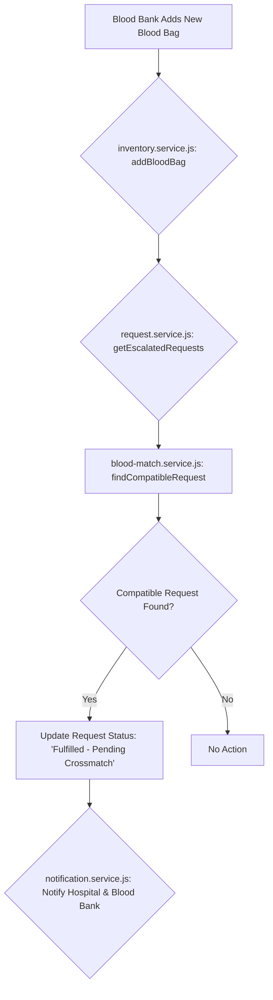
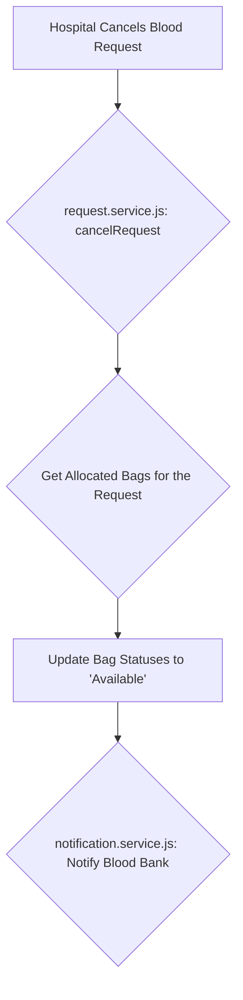

# Automated Blood Bag Matching and Escalation Workflow

## 1. Introduction

The current system for matching blood bags to requests is a manual process that is prone to delays and errors. This document outlines a new, automated workflow that will streamline the matching process, ensure timely fulfillment of requests, and provide a clear escalation path for unfulfilled requests.

## 2. Goals

The primary goals of this new automated workflow are:

*   **Automation:** To fully automate the process of matching blood bags to requests, eliminating the need for manual intervention.
*   **Efficiency:** To improve the speed and accuracy of the matching process, ensuring that patients receive the blood they need as quickly as possible.
*   **Clarity:** To provide a clear and transparent system for tracking the status of blood requests, from creation to fulfillment or escalation.
*   **Reliability:** To ensure that all requests are handled consistently and that escalations are triggered automatically when necessary.

## 3. System Architecture and Data Flow

The automated matching system will be implemented within the existing client-side application. The core logic will be integrated into the existing services, and the UI event handlers will orchestrate the automated workflow.

### 3.1. Trigger 1: New Blood Request Created

This workflow is triggered when a hospital user creates a new blood request.

**Data Flow Steps:**

1.  **Request Creation:** A hospital user creates a new blood request, which calls the `createRequest` function in `request.service.js`.
2.  **Fetch Available Bags:** The `createRequest` function calls the `inventory.service.js` to retrieve all blood bags with the status "Available".
3.  **Run Matching Algorithm:** The function then passes the patient's blood profile and the list of available bags to the `blood-match.service.js` to find compatible matches.
4.  **Update Request Status:**
    *   If the number of compatible bags meets or exceeds the requested quantity, the request's status is updated to "Fulfilled - Pending Crossmatch".
    *   If the number of compatible bags is insufficient, the request's status is updated to "Escalated".
5.  **Send Notifications:** The function sends notifications to the hospital and blood bank, informing them of the new request status.

### 3.2. Trigger 2: New Blood Bag Added

This workflow is triggered when a blood bank user adds a new blood bag.

**Data Flow Steps:**

1.  **Bag Creation:** A blood bank user adds a new blood bag, which calls the `addBloodBag` function in `inventory.service.js`.
2.  **Fetch Escalated Requests:** The `addBloodBag` function calls the `request.service.js` to retrieve all requests with the status "Escalated".
3.  **Run Matching Algorithm:** The function iterates through the escalated requests and uses the `blood-match.service.js` to check if the new bag is a compatible match for any of them.
4.  **Update Request Status:** If a compatible request is found, its status is updated to "Fulfilled - Pending Crossmatch".
5.  **Send Notifications:** The function sends notifications to the hospital and blood bank, informing them that a previously escalated request has now been fulfilled.

### 3.3. Trigger 3: Blood Request Canceled

This workflow is triggered when a hospital user cancels a blood request.

**Data Flow Steps:**

1.  **Request Cancellation:** A hospital user cancels a blood request, which calls the `cancelRequest` function in `request.service.js`.
2.  **Get Allocated Bags:** The `cancelRequest` function retrieves the list of `allocatedBags` from the canceled request.
3.  **Update Bag Statuses:** The function calls the `inventory.service.js` to update the status of all allocated bags back to "Available", making them available for other requests.
4.  **Send Notifications:** The function sends a notification to the blood bank to inform them that the bags are now available.

## 4. Matching Algorithm and Escalation Logic

### 4.1. Matching Algorithm

The core of the automated workflow is the matching algorithm, which will be an enhanced version of the existing `findCompatibleBloodBags` function. The algorithm will be executed by the services and will have the following logic:

1.  **Prioritization:** Requests will be prioritized based on their `urgency` field, in the order of "EMERGENCY", "URGENT", and "ROUTINE".
2.  **Compatibility Check:** For each request, the algorithm will use the `isCompatible` function from the `blood-match.service.js` to check for compatible bags in the inventory.
3.  **Allocation:**
    *   If a sufficient number of compatible bags are found, they will be allocated to the request, and the request's status will be updated to "Fulfilled - Pending Crossmatch".
    *   The allocated bags will have their status updated to "Allocated" to prevent them from being assigned to other requests.

### 4.2. Escalation Conditions

A request will be automatically escalated under the following conditions:

1.  **Insufficient Inventory:** If the matching algorithm runs and cannot find enough compatible blood bags to fulfill the request, the request's status will be immediately updated to "Escalated".
2.  **Time-Based Escalation:** To prevent requests from languishing, a time-based escalation mechanism will be implemented.
    *   **Urgent Requests:** If an "URGENT" request is not fulfilled within a predefined time frame (e.g., 4 hours), it will be automatically escalated.
    *   **Routine Requests:** If a "ROUTINE" request is not fulfilled within a predefined time frame (e.g., 24 hours), it will be automatically escalated.

## 5. Database Schema and Service Changes

To support the new automated workflow, the following changes will be required to the Firestore database schema and the existing services.

### 5.1. Database Schema Changes

**`requests` collection:**

*   No major changes are required to the schema itself, but the `status` field will now be managed automatically by the services. The possible values for the `status` field will be:
    *   `Pending Allocation`: The initial status of a new request.
    *   `Fulfilled - Pending Crossmatch`: The status when enough compatible bags have been allocated.
    *   `Escalated`: The status when the request cannot be fulfilled.
    *   `CANCELLED_BY_HOSPITAL`: The status when the request is canceled.
    *   `Fulfilled`: The final status after crossmatching is complete.

**`bloodbags` collection:**

*   The `status` field will be updated to include an `Allocated` status, which will be used to reserve bags for a specific request.

### 5.2. Service Changes

**`request.service.js`:**

*   The `createRequest` function will be updated to orchestrate the matching process.
*   The `cancelRequest` function will be updated to handle the logic of returning allocated bags to the inventory.

**`inventory.service.js`:**

*   The `addBloodBag` function will be updated to orchestrate the matching process for escalated requests.
*   A new function, `updateBagStatus`, will be created to allow the services to update the status of individual bags.

**`blood-match.service.js`:**

*   The `findCompatibleBloodBags` function will be enhanced to handle the new prioritization logic.
