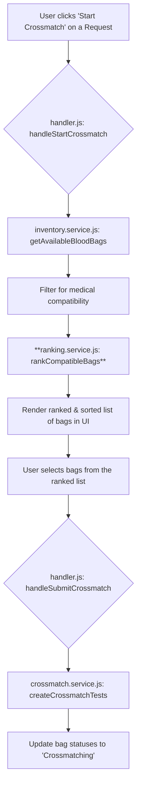

# Implementation Plan: Smart Blood Bag Ranking System

This document outlines the plan to implement a "smart system" for ranking blood bags during the crossmatch process. The system will prioritize patient safety, reduce waste, and preserve universal donor blood types.

## 1. New Module: Ranking Service

A new, self-contained module will be created to house all the ranking logic. This promotes separation of concerns and makes the system easier to maintain and test.

*   **File Location:** [`scripts/services/ranking.service.js`](scripts/services/ranking.service.js)

### 1.1. Constants and Configuration

The following constants will be defined at the top of the new file.

```javascript
// Blood compatibility rules
const BLOOD_COMPATIBILITY = {
  "A+": ["A+", "A-", "O+", "O-"], "A-": ["A-", "O-"],
  "B+": ["B+", "B-", "O+", "O-"], "B-": ["B-", "O-"],
  "AB+": ["A+", "A-", "B+", "B-", "AB+", "AB-", "O+", "O-"],
  "AB-": ["A-", "B-", "AB-", "O-"],
  "O+": ["O+", "O-"], "O-": ["O-"]
};

// Inverse universality scoring map
const DONATION_POTENTIAL_MAP = {
  "AB+": 1, "AB-": 2, "A+": 2, "B+": 2,
  "O+": 4, "A-": 4, "B-": 4, "O-": 8
};

// Scoring weights
const WEIGHTS = {
  MATCH: 0.60,
  EXPIRY: 0.25,
  UNIVERSALITY: 0.15
};

// Standard blood bag shelf life in days
const BLOOD_SHELF_LIFE_DAYS = 42;
```

### 1.2. Core Ranking Function

A single public function will be exported from this module.

*   `rankCompatibleBags(patientBloodType, compatibleBags)`
    *   **Description:** Takes a patient's blood type and a list of medically compatible blood bags, then returns a new list of those bags sorted according to the smart ranking algorithm.
    *   **Parameters:**
        *   `patientBloodType` (string): The blood type of the patient (e.g., "A+").
        *   `compatibleBags` (Array<BloodBag>): An array of `BloodBag` objects that have already been filtered for basic compatibility and availability.
    *   **Returns:** (Array<BloodBag>): A new array of `BloodBag` objects, sorted in descending order of `TotalScore`.

### 1.3. Internal Helper Functions

The following pure functions will be created within the module to handle the scoring logic.

*   `calculateTotalScore(bag, patientBloodType)`: Calculates the weighted total score for a single blood bag.
*   `calculateMatchScore(bagBloodType, patientBloodType)`: Calculates the `S_match`.
*   `calculateExpiryUrgencyScore(expiryDate)`: Calculates the `S_expiry`.
*   `calculateInverseUniversalityScore(bagBloodType)`: Calculates the `S_universality`.

## 2. Integration with Existing Code

The new ranking service will be integrated into the existing crossmatch workflow.

### 2.1. `scripts/views/bloodbank/handler.js`

The `handleStartCrossmatch` function will be modified to use the new ranking service.

**Current Logic:**
1.  Fetches all available blood bags.
2.  Filters them for medical compatibility.
3.  Renders the simple, unsorted list of compatible bags to the UI.

**Proposed Changes:**
1.  **Import:** Add `import { rankCompatibleBags } from '../../services/ranking.service.js';` at the top of the file.
2.  **Modify `handleStartCrossmatch`:**
    *   After filtering for compatible bags, call the new ranking service:
        ```javascript
        const allAvailableBags = await services.inventory.getAvailableBloodBags();
        const compatibleBags = allAvailableBags.filter(bag => compatibleTypes.includes(bag.bloodType));
        
        // --- NEW ---
        const rankedBags = rankCompatibleBags(patientBloodType, compatibleBags);
        // --- END NEW ---

        // Use the 'rankedBags' array instead of 'compatibleBags' to render the UI list.
        if (rankedBags.length === 0) {
            cmBagList.innerHTML = `<p class="text-center text-gray-500">No medically compatible blood bags are available in the inventory.</p>`;
        } else {
            rankedBags.forEach(bag => {
                const div = document.createElement('div');
                div.className = 'flex items-center justify-between p-3 hover:bg-gray-100 rounded-lg';
                div.innerHTML = `<div><p class="font-semibold">${bag.id}</p><p class="text-sm text-gray-600">Type: ${bag.bloodType}</p></div><input type="checkbox" data-bag-id="${bag.id}" class="cm-checkbox h-5 w-5 text-red-600 border-gray-300 rounded focus:ring-red-500">`;
                cmBagList.appendChild(div);
            });
        }
        ```

### 2.2. `scripts/services/crossmatch.service.js`

**No changes are required.** The ranking logic is applied *before* the user selects bags and submits them for crossmatching. This service is only responsible for creating the crossmatch test records after the selection is made.

## 3. Workflow Diagram



This plan ensures the new logic is modular, testable, and cleanly integrated into the existing application flow without disrupting other services.